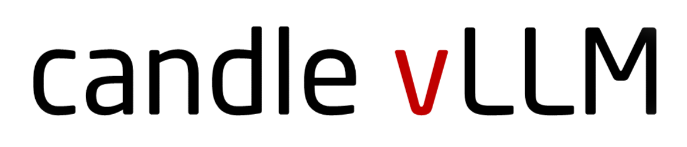

<p align="center">
    
</p>

[](https://github.com/EricLBuehler/candle-vllm/actions/workflows/ci.yml)

Efficient, easy-to-use platform for inference and serving local LLMs including an OpenAI compatible API server.

## Features
- OpenAI compatible API server provided for serving LLMs.
- Highly extensible trait-based system to allow rapid implementation of new module pipelines,
- Streaming support in generation.
- Efficient management of key-value cache with PagedAttention.
- Continuous batching.

## Develop Status

Currently, candle-vllm supports chat serving for the following models.

| Model ID | Model Type | Supported | Speed (A100, BF16) | Throughput (bs=16)
|--|--|--|--|--|
| #1 | **LLAMA/LLAMA2/LLaMa3/LLaMa3.1** |✅|74 tks/s (7B), 65 tks/s (LLaMa3.1 8B)| 553 tks/s (LLaMa3.1 8B) |
| #2 | **Mistral** |✅|70 tks/s (7B)| 585 tks/s (7B) |
| #3 | **Phi (v1, v1.5, v2)** |✅|97 tks/s (2.7B, F32+BF16)|TBD|
| #4 | **Phi-3 （3.8B, 7B）** |✅|107 tks/s (3.8B)| 744 tks/s (3.8B)|
| #5 | **Yi** |✅|75 tks/s (6B)| 566 tks/s (6B) |
| #6 | **StableLM** |✅|99 tks/s (3B)|TBD|
| #7 | BigCode/StarCode |TBD|TBD|TBD |
| #8 | ChatGLM |TBD|TBD|TBD |
| #9 | **QWen2 (1.8B, 7B)** |✅|148 tks/s (1.8B)|784 tks/s (1.8B) |
| #10 | **Google Gemma** |✅|130 tks/s (2B)|TBD |
| #11 | Blip-large (Multimodal) |TBD|TBD|TBD |
| #12 | Moondream-2 (Multimodal LLM) |TBD|TBD|TBD |


## Demo Chat with candle-vllm (61-65 tokens/s, LLaMa3.1 8B, bf16, on A100)

https://github.com/user-attachments/assets/290d72d8-d5e6-41a3-8bd8-1d9d732aee3b


## Usage
See [this folder](examples/) for some examples.

### Step 1: Run Candle-VLLM service (assume llama2-7b model weights downloaded)

```
curl --proto '=https' --tlsv1.2 -sSf https://sh.rustup.rs | sh
sudo apt install libssl-dev
sudo apt install pkg-config
git clone git@github.com:EricLBuehler/candle-vllm.git
cd candle-vllm
cargo run --release -- --port 2000 --weight-path /home/llama2_7b/ llama
```

You may also run specific model using huggingface model-id, e.g.,
```
cargo run --release -- --port 2000 --model-id meta-llama/Llama-2-7b-chat-hf llama
```

Run latest LLaMa3.1 using local weights

```
cargo run --release -- --port 2000 --weight-path /home/Meta-Llama-3.1-8B-Instruct/ llama3
```
### Step 2:

#### Option 1: Chat with ChatUI (recommended)
Install ChatUI and its dependencies:

```
git clone git@github.com:guoqingbao/candle-vllm-demo.git
cd candle-vllm-demo
apt install npm #install npm if needed
npm install n -g #update node js if needed
n stable #update node js if needed
npm i -g pnpm #install pnpm manager
pnpm install #install ChatUI dependencies
```

Launching the ChatUI:
```
pnpm run dev # run the ChatUI
```

#### Option 2: Chat completion request with HTTP post

``` shell
curl -X POST "http://127.0.0.1:2000/v1/chat/completions" \
     -H "Content-Type: application/json" \
     -H "Authorization: Bearer YOUR_API_KEY" \
     -d '{
           "model": "llama7b",
           "messages": [
               {"role": "user", "content": "Explain how to best learn Rust."}
           ],
           "temperature": 0.7,
          "max_tokens": 128,
          "stop": {"Single":"</s>"}
       }'
```
Sample response:

```
{"id":"cmpl-53092967-c9cf-40e0-ae26-d7ac786d59e8","choices":[{"message":{"content":" Learning any programming language requires a combination of theory, practice, and dedication. Here are some steps and resources to help you learn Rust effectively:\n\n1. Start with the basics:\n\t* Understand the syntax and basic structure of Rust programs.\n\t* Learn about variables, data types, loops, and control structures.\n\t* Familiarize yourself with Rust's ownership system and borrowing mechanism.\n2. Read the Rust book:\n\t* The Rust book is an official resource that provides a comprehensive introduction to the language.\n\t* It covers topics such","role":"[INST]"},"finish_reason":"length","index":0,"logprobs":null}],"created":1718784498,"model":"llama7b","object":"chat.completion","usage":{"completion_tokens":129,"prompt_tokens":29,"total_tokens":158}}
```

#### Option 3: Chat completion with with openai package

In your terminal, install the `openai` Python package by running `pip install openai`. I use version `1.3.5`.

Then, create a new Python file and write the following code:
```python
import openai

openai.api_key = "EMPTY"

openai.base_url = "http://localhost:2000/v1/"

completion = openai.chat.completions.create(
    model="llama",
    messages=[
        {
            "role": "user",
            "content": "Explain how to best learn Rust.",
        },
    ],
    max_tokens = 64,
)
print(completion.choices[0].message.content)
```
After the `candle-vllm` service is running, run the Python script and enjoy efficient inference with an OpenAI compatible API server!


## Batched requests

Refer to `examples/benchmark.py`

``` python
async def benchmark():
    model = "mistral7b"
    max_tokens = 1024
    # 16 requests
    prompts = ["Explain how to best learn Rust.", 
               "Please talk about deep learning in 100 words.", 
               "Do you know the capital city of China? Talk the details of you known.", 
               "Who is the best female actor in the world? Explain why.",
               "How to dealing with depression?",
               "How to make money in short time?",
               "What is the future trend of large language model?",
               "The famous tech companies in the world.",
               "Explain how to best learn Rust.", 
               "Please talk about deep learning in 100 words.", 
               "Do you know the capital city of China? Talk the details of you known.", 
               "Who is the best female actor in the world? Explain why.",
               "How to dealing with depression?",
               "How to make money in short time?",
               "What is the future trend of large language model?",
               "The famous tech companies in the world."]
    
    # send 16 chat requests at the same time
    tasks: List[asyncio.Task] = []
    for i in range(len(prompts)):
        tasks.append(
            asyncio.create_task(
                chat_completion(model, max_tokens, prompts[i]))
        )

    # obtain the corresponding stream object for each request
    outputs: List[Stream[ChatCompletionChunk]] = await asyncio.gather(*tasks)

    # tasks for streaming chat responses
    tasks_stream: List[asyncio.Task] = []
    for i in range(len(outputs)):
        tasks_stream.append(
            asyncio.create_task(
                stream_response(i, outputs[i]))
        )

    # gathering the response texts
    outputs: List[(int, str)] = await asyncio.gather(*tasks_stream)

    # print the results, you may find chat completion statistics in the backend server (i.e., candle-vllm)
    for idx, output in outputs:
        print("\n\n Response {}: \n\n {}".format(idx, output))


asyncio.run(benchmark())
```


## Usage Help
For general configuration help, run `cargo run -- --help`.

For model-specific help, run `cargo run -- --port 2000 <MODEL_TYPE> --help`

For local model weights, run `cargo run --release -- --port 2000 --weight-path /home/llama2_7b/ llama`, change the path when needed.

`MODEL_TYPE` = ["llama", "llama3", "mistral", "phi2", "phi3", "qwen2", "gemma", "yi", "stable-lm"]

`WEIGHT_FILE_PATH` = Corresponding weight path for the given model type

```
cargo run --release -- --port 2000 --weight-path <WEIGHT_FILE_PATH> <MODEL_TYPE>
```

or

`MODEL_ID` = Huggingface model id

```
cargo run --release -- --port 2000 --model-id <MODEL_ID> <MODEL_TYPE>
```

For kvcache configuration, set `kvcache_mem_cpu` and `kvcache_mem_gpu`, default 4GB CPU memory and 4GB GPU memory for kvcache. 

For chat history settings, set `record_conversation` to `true` to let candle-vllm remember chat history. By `default`, candle-vllm `does not` record chat history; instead, the client sends both the messages and the contextual history to candle-vllm. If record_conversation is set to `true`, the client sends only new chat messages to candle-vllm, and candle-vllm is responsible for recording the previous chat messages. However, this approach requires per-session chat recording, which is not yet implemented, so the default approach `record_conversation=false` is recommended.

For chat streaming, the `stream` flag in chat request need to be set to `True`.

You may supply `penalty` and `temperature` to the model to **prevent potential repetitions**, for example:

```
cargo run --release -- --port 2000 --weight-path /home/mistral_7b/ mistral --repeat-last-n 64 --penalty 1.1 --temperature 0.7
```

`--max-gen-tokens` parameter is used to control the maximum output tokens per chat response. The value will be set to 1/5 of max_sequence_len by default.

## Report issue
Installing `candle-vllm` is as simple as the following steps. If you have any problems, please create an
[issue](https://github.com/EricLBuehler/candle-lora/issues).


## Contributing
The following features are planned to be implemented, but contributions are especially welcome:
- Sampling methods:
  - Beam search ([huggingface/candle#1319](https://github.com/huggingface/candle/issues/1319))
- More pipelines (from `candle-transformers`)

## Resources
- Python implementation: [`vllm-project`](https://github.com/vllm-project/vllm)
- [`vllm` paper](https://arxiv.org/abs/2309.06180)
